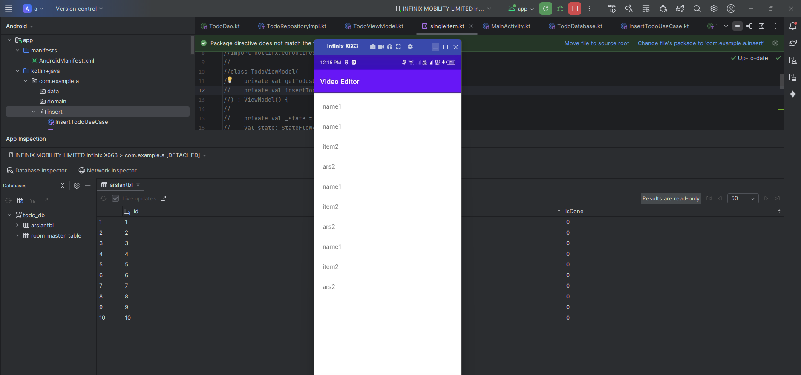

Below is full Roman Urdu explanation, class-by-class, variable-by-variable, table-by-table — and why do you have TWO models with SAME names (TodoEntity & Todo).
Everything is explained simple language, no technical confusion.

✅ PEHLA IMPORTANT SAWAL
❓ “Do model kyun hain — TodoEntity aur Todo — dono mein same type ka data?”
✔ JAWAB (Roman Urdu mein sab se clear):

Android + Clean Architecture mein 2 layers hoti hain:

1) Database Model (Room Entity) → TodoEntity

Ye sirf Room Database ke liye banti hai.
Isse app ke andar data ka internal structure maintain hota hai.

→ Ye database table ko represent karti hai.
→ Ye Room ke annotations use karti hai (@Entity, @PrimaryKey).
→ Ye directly UI ko nahi dikhate.

2) Domain/UI Model → Todo

Ye app ke UI/ViewModel ke liye use hoti hai.
Ye simple, clean model hoti hai — Room aur database ka naam yahan nahi hota.

💡 Isliye 2 models ISLIYE banaye jaate hain:
Layer	Model	Kyun use hoti hai
Database	TodoEntity	Database table banane ke liye
UI/Domain	Todo	Screen/UI/ViewModel mein clean model use karne ke liye

👉 Agar sirf Room Entity use karo, to app tightly database se bind ho jati.
👉 Separate UI Model rakho, to structure clean & reusable rehta hai.

Yeh bilkul professional clean architecture pattern hai.

🎯 Ab poora project Roman Urdu mein samjhata hoon — file by file
✅ 1) TodoEntity.kt (Database Model)

TodoEntity

@Entity(tableName = "arslantbl")
data class TodoEntity(
    @PrimaryKey(autoGenerate = true)
    val id: Int = 0,
    val name: String,
    val isDone: Boolean = false
)

✔ Roman Urdu Explanation

@Entity(tableName = "arslantbl")
→ Room Database mein arslantbl naam ki table banegi.

Table columns:
Column	Type	Meaning
id	Int (PK)	auto generate hota hai
name	String	To-do ka title database mein
isDone	Boolean	complete hua ya nahi
✅ 2) Todo.kt (UI Model)

Todo

data class Todo(
    val id: Int = 0,
    val title: String,
    val isDone: Boolean = false
)

✔ Roman Urdu Explanation

Ye UI/Domain model hai

Dekho difference:

Database field	UI field
name	title

👉 Dono ka purpose same, but naming UI-friendly hai.
👉 Ye clean architecture ka pattern hai.

✅ 3) TodoDao.kt (Database CRUD layer)

TodoDao

@Dao
interface TodoDao {

    @Query("SELECT * FROM arslantbl")
    fun getAll(): Flow<List<TodoEntity>>

    @Insert
    suspend fun insert(todo: TodoEntity)
}

✔ Roman Urdu Explanation

@Query("SELECT * FROM arslantbl")
→ database se saare records laaye ga.
→ Flow return karta hai — real-time updates.

@Insert
→ database mein ek new row insert karega.

✅ 4) TodoRepository.kt (Interface)

TodoRepository

Repository means → “data kahan se lana hai, UI ko farq nahi padta.”

interface TodoRepository {
    fun getTodos(): Flow<List<Todo>>
    suspend fun insertTodo(todo: Todo)
}

✔ Roman Urdu Explanation

Repository ek contract hota hai.
UI ko farq nahi padta ke data Room se aa raha hai ya API se.

✅ 5) TodoRepositoryImpl.kt (Actual implementation)

TodoRepositoryImpl

override fun getTodos(): Flow<List<Todo>> =
    dao.getAll().map { list ->
        list.map {
            Todo(
                id = it.id,
                title = it.name,
                isDone = it.isDone
            )
        }
    }

✔ Roman Urdu Explanation

Room se Entity aati hai

Ye convert hoti hai UI model (Todo) mein

Isi conversion ki wajah se 2 model classes hoti hain

override suspend fun insertTodo(todo: Todo) {
    dao.insert(
        TodoEntity(
            id = 0,
            name = todo.title
        )
    )
}

✔ Insert Explanation

UI model → database entity mein convert hota hai.

✅ 6) TodoState.kt

TodoState

data class TodoState(
    val isLoading: Boolean = false,
    val todos: List<Todo> = emptyList()
)

✔ Roman Urdu Explanation

ViewModel ka state hold karta hai

UI ko live updates milte hain.

✅ 7) TodoViewModel.kt

TodoViewModel

private val _state = MutableStateFlow(TodoState())

→ StateFlow mein hamara UI data rahta hai.

✔ loadTodos()

Flow ko collect karta hai aur state update karta hai.

✔ insertStatic()

3 new Todo insert karta hai:

name1

item2

ars2

Use case call karta hai.

✅ 8) GetTodosUseCase.kt

GetTodosUseCase

Simple function:

operator fun invoke() = repository.getTodos()

UseCases business logic ko separate rakhte hain.

✅ 9) TodoAdapter.kt

TodoAdapter

RecyclerView adapter — list show karta hai.

✅ 10) MainActivity.kt

MainActivity

✔ Steps in Roman Urdu:

Binding set hota hai

Room database create hoti hai

Repository banti hai

UseCases bante hain

ViewModel create hota hai

RecyclerView set hota hai

Static items insert kiye jate

Flow observe hota — list auto update hoti hai

🎯 FINAL SUMMARY (Roman Urdu)
✔ Dono models isliye hain:
Model	Kya kaam karta hai
TodoEntity	Database table ka structure
Todo	UI/ViewModel ke liye clean model

Ye architecture ka sahi pattern hai — best practice.

👉 Ab aap chaho to main aapke liye:

✅ Architecture diagram bana dun
✅ Flow diagram Roman Urdu mein
✅ Insert/Delete/Update full system bana dun
✅ Compose UI bana dun
✅ Single model use karne ka version bhi bana dun (agar chaho)

Bas batao next kya chahiye ❤️
